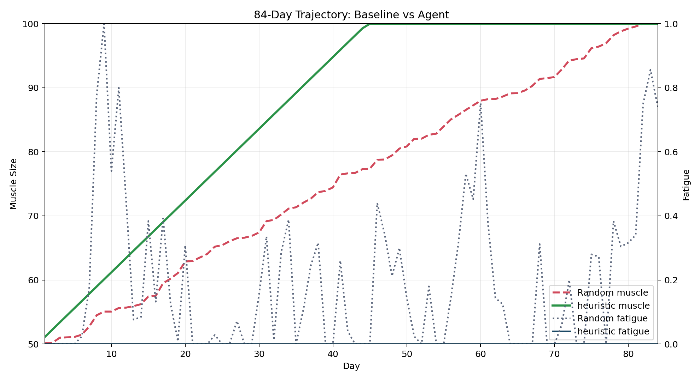

# Hypertrophy Environment (Final Submission)

Real-world OpenEnv environment for a 12-week (84-day) hypertrophy program.
The agent must maximize muscle gain while managing fatigue through daily control of training intensity, volume, and recovery.

## Submission Summary

- Real-world simulation (not a toy/game): hypertrophy training and recovery management.
- OpenEnv spec implemented: typed models, reset/step/state, openenv.yaml.
- Three task graders with explicit difficulty labels and score range [0.0, 1.0].
- Reward shaping includes partial progress signals (muscle delta, fatigue penalty, recovery bonus).
- Baseline evaluation and reproducibility controls included.
- Docker + HF Spaces deployment path included.

## Quick Start

```bash
# 1) install dependencies
uv sync

# 2) run inference against the remote server
$env:ENV_BASE_URL="https://novelcoder123-hypertrophy-env-openenv.hf.space"
$env:HYPERTROPHY_TASK="muscle_gain"
uv run python inference.py
```

## OpenEnv Manifest (openenv.yaml)

`openenv.yaml` is the launch manifest used by OpenEnv tooling and validators.

- `spec_version`: manifest schema version.
- `name`: environment identifier.
- `type`: deployment type (`space`).
- `runtime`: app framework (`fastapi`).
- `app`: entrypoint (`server.app:app`).
- `port`: service port (`8000`).

If you change app module path or port, update this file accordingly.

## Environment Specification

### Action Space

HypertrophyAction:
- intensity: int in [1, 10]
- volume: int in [1, 10]
- recovery_strategy: int in [1, 10]

### Observation Space

HypertrophyObservation:
- day: int in [0, 84]
- muscle_size: float in [50.0, 100.0]
- strength: float in [50.0, 100.0]
- fatigue: float in [0.0, 1.0]
- status_message: str
- reward: float
- done: bool
- metadata: dict (includes week, effective_stimulus, avg_fatigue, overtrain_days, etc.)

### Transition + Reward

- effective_stimulus = intensity * volume * (1 - fatigue^2)
- muscle growth and strength gains are bounded and depend on effective stimulus.
- fatigue accumulates from training and is reduced by recovery.

Reward shaping:
- base reward: muscle_delta * 10.0
- fatigue penalty: -20.0 * max(0, fatigue - 0.8)^2
- recovery bonus: +1.0 when recovery_strategy >= 7 and fatigue < 0.3

## Task Graders (Easy -> Medium -> Hard)

| Difficulty | Task | Score Formula | Score Range |
|------------|------|---------------|-------------|
| easy | muscle_gain | (final_muscle - 50) / 50 | [0.0, 1.0] |
| medium | fatigue_management | (1 - avg_fatigue) * muscle_score | [0.0, 1.0] |
| hard | periodization | muscle_score * 0.6 + no_overtrain * 0.4 | [0.0, 1.0] |

Select task with:

```bash
HYPERTROPHY_TASK=muscle_gain
```

## Reproducibility

Inference controls:
- REPRODUCIBLE_MODE=1 (default)
- INFERENCE_SEED=42
- TEMPERATURE=0.0

Evaluation controls:
- EVAL_SEED=42
- EVAL_EPISODES configurable (recommend >= 10)

No temporary containers by default:
- inference.py and evaluate_agent.py require ENV_BASE_URL / ENV_HTTP_URL by default.
- Set ALLOW_TEMP_CONTAINERS=1 only if you intentionally want Docker fallback.

## Artifacts and Evidence

Generated in artifacts/:
- policy_summary.csv
- trajectory_comparison.png
- trajectory_*.json

Commit policy_summary.csv and trajectory_comparison.png for judge verification.
Trajectory JSON files are run-by-run debug traces and can remain git-ignored.

What each artifact shows:
- policy_summary.csv: per-episode baseline/agent metrics with task + task_difficulty.
- trajectory_comparison.png: baseline vs agent trajectory view (muscle and fatigue over time).
- trajectory JSON files: full step-by-step action/observation/reward traces.



### Snapshot from previous outputs (muscle_gain, n=10 each baseline)

| Policy | Avg Score | Min | Max |
|--------|-----------|-----|-----|
| random | 0.9258 | 0.8456 | 1.0000 |
| fixed_5_5_5 | 0.8400 | 0.8400 | 0.8400 |
| heuristic | 1.0000 | 1.0000 | 1.0000 |

These values are from artifacts/policy_summary.csv generated in this workspace.

Interpretation note:
- Random policy can score relatively high on `muscle_gain` because this task rewards final size more than training quality details.
- Use `fatigue_management` and `periodization` to stress robustness; these penalize poor recovery/overtraining and are harder to game.

## Setup and Run

### 1) Install Dependencies

```bash
uv sync
```

### 2) Run Server Locally

```bash
uvicorn server.app:app --host 0.0.0.0 --port 8000
```

### 3) Set Environment Variables

Required:
- HF_TOKEN (if provider requires auth)
- API_BASE_URL (example: `https://router.huggingface.co/v1`)
- MODEL_NAME (tested example: `Qwen/Qwen2.5-72B-Instruct`)

Common runtime:
- HYPERTROPHY_TASK
- ENV_BASE_URL

### 4) Run Inference

```bash
uv run python inference.py
```

Expected stdout format:
- [START] ...
- [STEP] ... (per step)
- [END] success=<true|false> steps=<n> score=<0..1> rewards=...

### 5) Run Baselines / Evaluation

```bash
EVAL_EPISODES=20 ENABLE_LLM_EVAL=0 uv run python evaluate_agent.py
```

`evaluate_agent.py` purpose:
- Runs baseline policies (random/fixed/heuristic) and optional LLM policy.
- Writes comparable metrics to `artifacts/policy_summary.csv`.
- Generates trajectory visual comparison (`artifacts/trajectory_comparison.png`).

How it differs from `inference.py`:
- `inference.py`: single policy rollout with START/STEP/END logs for validator-style execution.
- `evaluate_agent.py`: multi-episode benchmark runner for evidence and reproducibility.

## Docker

### Build

```bash
docker build -t hypertrophy_env:latest .
```

### Run

```bash
docker run -p 8000:8000 hypertrophy_env:latest
```

## Hugging Face Spaces Deployment

### Create Space

- SDK: Docker
- Hardware: CPU Basic
- Visibility: Public (recommended for validator accessibility)

### Deploy

```bash
openenv push --repo-id novelcoder123/hypertrophy-env-openenv
```

### Post-Deploy Validation

```bash
# health must return 200
curl https://novelcoder123-hypertrophy-env-openenv.hf.space/health

# reset must respond correctly
curl -X POST https://novelcoder123-hypertrophy-env-openenv.hf.space/reset
```

## Validator-Oriented Checklist

- Docker image builds successfully.
- /health returns 200.
- /reset responds with valid initial observation.
- inference.py runs end-to-end and prints valid START/STEP/END lines.
- All three task variants return score in [0.0, 1.0].
- Artifacts are produced for evidence (policy_summary.csv, trajectory_comparison.png, trajectory JSON).

## Repository Structure

```text
hypertrophy_env/
|- openenv.yaml
|- models.py
|- client.py
|- inference.py
|- evaluate_agent.py
|- Dockerfile
|- README.md
|- artifacts/
|  |- policy_summary.csv
|  |- trajectory_comparison.png
|  |- trajectory_*.json
`- server/
   |- app.py
   `- hypertrophy_env_environment.py
```
